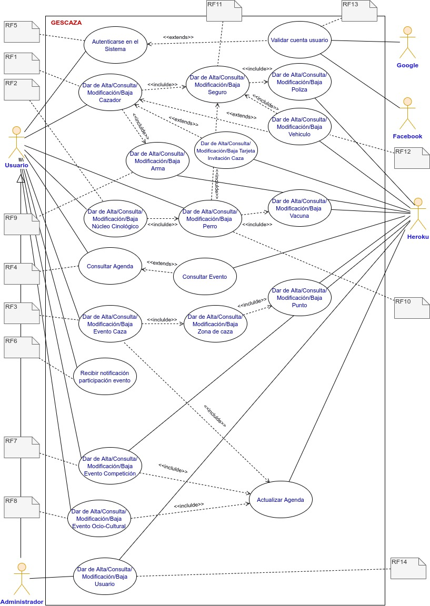
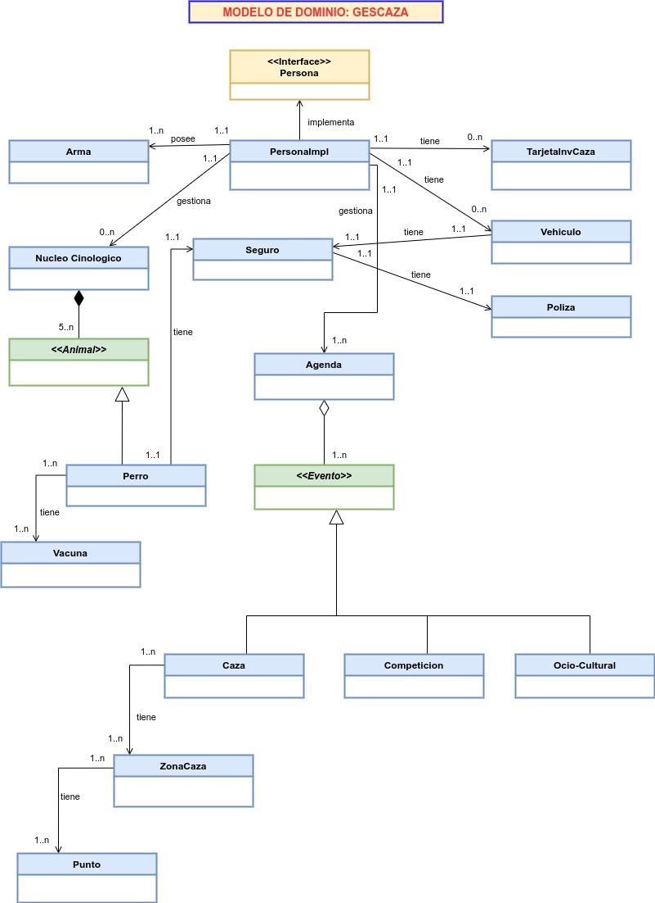

# **ERS 1.- DEFINICIÓN DEL SISTEMA**

## **ERS 1.1-. DETERMINACIÓN DEL ALCANCE DEL SISTEMA**

La aplicación que se desarrollará tendrá la funcionalidad principal de gestionar los eventos deportivos principales de la caza.

El Sistema se desarrollará en entorno web y responsive, para que su acceso sea multiplataforma y multidispositivo.

Quedan **dentro** del alcance del Sistema:

- CRUD del cazador (datos personales, tarjeta invitación del coto, vehículo, seguro, armas, núcleo cinológico si lo forma y los perros).
- CRUD de los eventos de caza más importantes (Caza, Competición, Ocio-Cultural).
- Consultar los eventos a través de una agenda.
- Autenticación para acceso al sistema.
- Notificación de eventos (con 72h de antelación).
- Inicio de sesión a través de la cuenta de correo de Google ó Facebook.
- Perfiles de usuario (usuario, administrador).

Quedan **fuera** del alcance del Sistema:

- CRUD rehalas de perros.
- Gestión entrenamiento del cazador o del perro.
- Gestión de documentación.

## **ERS 1.2.- GLOSARIO DE TÉRMINOS Y ABREVIATURAS**

Se define el glosario de términos del ámbito del negocio:

- **Cazador**: persona que caza por oficio o por diversión.
- **Núcleo cinológico**: todo centro, establecimiento y/o instalación que aloje, mantenga, críe y/o vendan animales, sea ésta su actividad principal o no, e independientemente de que tenga finalidad mercantil. A partir de 4 ó 5 animales (depende de la Comunidad Autonómica) se considera núcleo cinológico.
- **Caza menor**: caza de liebres, conejos, perdices, palomas u otros animales semejantes.
- **Caza mayor**: caza de jabalíes, lobos, ciervos u otros animales semejantes. 
- **Rehala**: Aquella que almacena el sistema y no requiere preconfiguración por parte del usuario.
- **Caza al salto**: Es la modalidad en la cual el cazador, con o sin perro, caza una zona de terreno intentando abatir las piezas que se le levantan a su paso. 
- **Evento**: actividad deportiva, de ocio o cultural relacionada con la caza.
- **Batida**: Un grupo de cazadores baten una pequeña extensión de terreno, contando con
la ayuda de algunos perros.
- **Tarjeta Invitación**: es una tarjeta que sirve para invitar a un cazador a una cacería en un coto del cual no es socio.
- **Seguro del cazador** : Seguro de responsabilidad civil obligatoria para el cazador.
- **Seguro del perro**: Seguro de responsabilidad civil obligatoria para el perro.
- **Chip de un perro**: Un microchip para perros es un pequeño chip de computadora del tamaño de un grano de arroz que contiene un código único que corresponde a los detalles de un perro.
- **Cartilla de vacunación perro**: (O expulsión) Se utiliza para que el jugador abandone el partido y no sea reemplazado por otro, quedando el equipo con un jugador menos.
- **Cartilla sanitaria de un perro**: La cartilla o pasaporte para animales de compañía contiene información fundamental sobre tu perro y tiene un número único y exclusivo para cada perro: Datos del propietario. Datos del perro: fotografía, descripción, fecha de nacimiento, características, etc. Marcado del animal.

## **ERS 1.3.- MODELO DE NEGOCIO**

## **ERS 1.4.- MODELO DE DOMINIO**

## **ERS 1.5.- IDENTIFICACIÓN DEL ENTORNO TECNOLÓGICO**

El desarrollo se realizará en ordenadores personales y con software libre.
El despliegue será en la nube, apoyándose en la plataforma [Heroku](https://www.heroku.com/home) y en [GitHub](https://github.com/) como servidor, y utilizando [GITEIE](https://git.institutomilitar.com/)/[GitHub](https://github.com/) para el control de versiones, repositorio de documentación (wikis) y gestión de tareas (kanbans).

En cuanto al software, durante el desarrollo de la aplicación se usará [ANGULAR](https://angular.io/), programando en lenguaje Java, y utilizando una base de datos [H2](https://www.h2database.com/html/main.html) (en fase de producción se desplegará sobre [Heroku Postgres](https://www.heroku.com/postgres)).

## **ERS 1.6.- ESPECIFICACIONES DE ESTÁNDARES Y NORMAS**

- Metodología ágil [SCRUM](https://scrumguides.org/).

- Metodología de la programación: Programación Orientada a Objetos.

- Base de Datos Relacional SQL.

- Recomendaciones del World Wide Web Consortium ([W3C](https://www.w3.org/)) para la accesibilidad y usabilidad web.

- [Ley Orgánica 3/2018, de 5 de diciembre, de Protección de Datos Personales y garantía de los derechos digitales](https://www.boe.es/eli/es/lo/2018/12/05/3).

## **ERS 1.7.- IDENTIFICACIÓN DE USUARIOS PARTICIPANTES Y FINALES**

| ROL | TIPO DE USUARIO  | RESPONSABILIDAD   |
| ------------------------------------ | -------------------- | --------------------------------------------------------------------------- |
| [Scrum máster](../EVS/EVS.md/#usuarios)  | Participante | Supervisar el proyecto y asesorar al equipo de desarrollo en la implementación de la metodología.|
| Product Owner | Participante | Desarrollar y comunicar explícitamente el Objetivo del Producto, asegurarse de que el trabajo pendiente del producto sea transparente, visible y comprendido. |
| [Cliente](../EVS/EVS.md/#usuarios)  | Participante y Usuario final | Verificación y comprobación de los requisitos implementados en el sistema.    |
| [Equipo de desarrollo](../EVS/2.EVS.SITACTUAL/#usuarios)  | Participante  | Llevar a cabo la implementación y desarrollo del sistema.  |

## ERS 2.2.- DIAGRAMA DE CASOS DE USO

Del análisis y estudio de los Requisitos, se extraen los siguientes casos de uso:

|CASO DE USO| DESCRIPCIÓN   |
|----------- |------------------ |
| **CU1**        | Autenticarse en el sistema      |
| **CU2**        | Alta/Consulta/Modificación/Baja Cazador |
| **CU3**        | Alta/Consulta/Modificación/Baja Núcleo Cinológico |
| **CU4**        | Alta/Consulta/Modificación/Baja Perro |
| **CU5**        | Consultar Agenda |
| **CU6**        | Alta/Consulta/Modificación/Baja Evento Caza |
| **CU7**        | Recibir notificación participación evento |
| **CU8**        | Alta/Consulta/Modificación/Baja Evento Competición |
| **CU9**        | Alta/Consulta/Modificación/Baja Evento Ocio-Cultural |
| **CU10**       | Alta/Consulta/Modificación/Baja Usuario |

## 2.4.- MATRIZ DE CUMPLIMIENTO DE REQUISITOS
            
|   |RF1|RF2|RF3|RF4|RF5|RF6|RF7| RF8|RF9|RF10|RF11|RF12|RF13|RF14|
|:-- |:--:|:--:|:--:|:--:|:--:|:--:|:--:|:-- |:--:|:--:|:--:|:--:|:--:|:--:|
|CU1  |  |  |  |   | X |  |  |  |  |  |  |  | X |  |
|CU2  | X |   |     |  |   |   |  | X |  | X |  X |  |  |
|CU3  |  | X |   |   |   |   |  |  |  |  |   |   |  |  |
|CU4  |  |   |   |   |   |   |   |  |  | X |  |   |  |  |
|CU5  |  |  |  | X |   |   |  |  |  |  |   |  |  |  |
|CU6  |  |   | X  |   |   |   |   |  |  |  |  |  |  |  |
|CU7  |  |   |   |   |   | X |   |  |  |  |  |  |  |  |
|CU8  |  |   |   |   |   |   | X  |  |  |  |  |  |  |  |
|CU9  |  |   |   |   |   |   |   | X |  |  |  |  |  |  |
|CU10  |  |   |   |   |   |   |   |  |  |  |  |  |  | X |

# ERS 3.- DEFINICIÓN DE LAS INTERFACES DE USUARIO

## ERS 3.1.- ESPECIFICACIÓN DE PRINCIPIOS GENERALES DE LA INTERFAZ

Se pretende crear una interfaz web con una usabilidad sencilla para el usuario. 

### PAGINA INICIO / INDEX ###
En el header aparecerá el logo del Sistema, um botón para inicio de sesión y un navbar con las siguientes opciones:
   - Consultar Agenda.
   - Gestionar Cazador.
   - Núcleo Cinológico.
   - Notificaciones.
   - Eventos Caza.
   - Eventos Competición.
   - Eventos Ocio-Cultural.
   - Gestinar Usuarios.
En todo momento aparecerá un breadcrumb indicando al usuario en qué página se encuentra.

En el cuerpo de la página mostrará la información relativa a la opción seleccionada.
Así mismo, se mostrará un menú lateral izquierdo con enlaces informativos (Federación caza, Normativa, Tienda, Revistas, Noticias y Meteorología).

El footer estará compuesto por dos enlaces informativos (Condicione de uso y Declaración de protección de datos) y por tres iconos con enlaces a Google, Home y Facebook.

### RESTO DE PÁGINAS ###

Lo único que irá variando será el cuerpo de la página, que mostrará el contenido relativo a la opción seleccionada.

## ERS 3.2.- ESPECIFICACIÓN DE FORMATOS INDIVIDUALES DE LA INTERFAZ DE PANTALLA

INTERFAZ USUARIO

## **ERS 4.- DEFINICIÓN DEL PRODUCTO MÍNIMO VIABLE (MVP)**

Tras el análisis y estudio de la ERS se ha definido el siguiente:

  - [**Producto Mínimo Vital** o **MVP**](MVP).

  - [**Product Baclog - La PILA**](Product_BACKLOG.MD).

# ERS 5.- PRESENTACIÓN Y APROBACIÓN DE LA ESPECIFICACIÓN DE REQUISITOS SOFTWARE.

El 22 de marzo de 2021, se presenta el ERS al cliente, dando como resultado su aprobación y firma.

**[Subir](#top)**

**[Volver](../ERS/ERS)**

**[HOME](../home)**